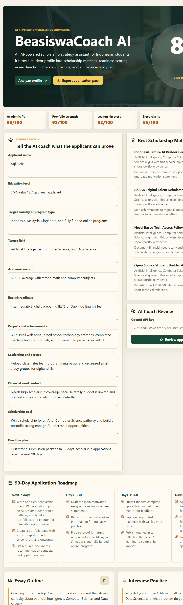
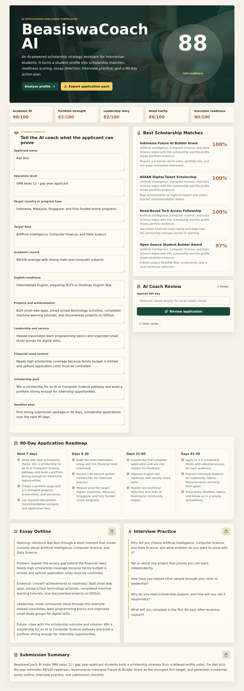

# BeasiswaCoach AI

**AI-powered scholarship strategy assistant for Indonesian students.**

BeasiswaCoach AI turns an unstructured student profile into a clear, actionable scholarship application plan — readiness scoring, scholarship matching, a 90-day roadmap, essay outlines, and interview preparation, all in one workflow.

[**Live demo →**](https://beasiswacoach-ai.vercel.app)



---

## The problem

Many Indonesian students have strong academic and personal profiles but struggle to turn that into a competitive scholarship application. Professional counseling is expensive and inaccessible to most. BeasiswaCoach AI closes that gap with an AI-guided, self-serve coaching workflow.

## How it works

1. **Profile input** — education level, target country, field, grades, English readiness, achievements, leadership, financial need, goals, deadline
2. **Readiness scoring** — deterministic scoring across academic fit, portfolio strength, leadership narrative, need clarity, and execution readiness
3. **Scholarship matching** — fit-percentage ranking across scholarship categories with suggested next actions
4. **90-day roadmap** — concrete milestones for documents, portfolio, essays, English prep, and applications
5. **AI coaching** — six specialized coach modes (Strategy, Essay, Interview, Financial Narrative, Portfolio, General) powered by an LLM, with configurable temperature, token limits, and sliding-window conversation memory
6. **Export** — downloadable JSON application pack



## Tech stack

- **Frontend** — React + TypeScript + Vite
- **AI** — OpenAI API (user-supplied key, browser-side), with a local rule-based fallback coach so the app works fully offline/without API access
- **Scoring** — deterministic, explainable logic (not a black-box LLM call) for the readiness score and scholarship matching, so results are consistent and auditable
- **Deployment** — Vercel

## Run locally

```bash
npm install
npm run dev
```

App runs at `http://localhost:5173` by default.

```bash
npm run build   # production build → dist/
```

## Why this design

The scoring and matching logic is deliberately **not** LLM-based — it's deterministic and transparent, so a student gets the same readiness score for the same inputs every time, and can see exactly which factors are driving it. The LLM is reserved for what it's actually good at: essay coaching, interview prep, and personalized narrative feedback, where variability and creativity are a feature, not a bug.

---

## Demo video

A 111-second walkthrough is available at `submission-assets/beasiswacoach-demo.mp4`, covering the full flow from profile input to exported application pack.

## License

MIT
